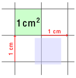

_libcm_ is a C application development framework with an emphasis on audio signal processing.

Some of its features are:

* entirely written in C 
* very few external dependencies (ALSA,FFTW,Atlas)
* a real-time audio/MIDI system
* a dataflow system
* many audio processing algorithms implemented in plain C.
* file readers and writers for WAV,AIFF,MIDI,CSV,MusicXML,XML among others

_libcm_ is big. The best way to get a sense of what is in it
is to [browse the documentation files here](https://currawong-project.github.io/libcm/).

